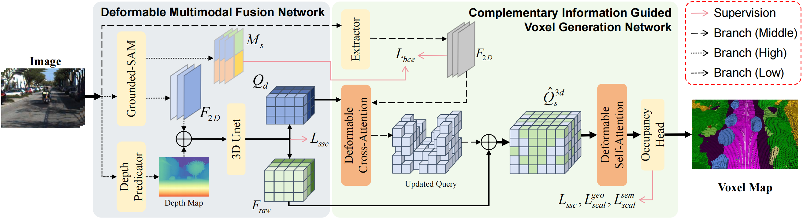

# CIGOcc: Complementary Information Guided Occupancy Prediction via Multi-Level Representation Fusion

 
 
 

This is the code of CIGOcc.

Camera-based occupancy prediction is a main-
stream approach for 3D perception in autonomous driving,
aiming to infer complete 3D scene geometry and semantics
from 2D images. Almost existing methods focus on improv-
ing performance through structural modifications, such as
lightweight backbones and complex cascaded frameworks, with
good yet limited performance. Few studies explore from the
perspective of representation fusion, leaving the rich diversity
of features in 2D images underutilized. Motivated by this, we
propose CIGOcc, a two-stage occupancy prediction framework
based on multi-level representation fusion. CIGOcc extracts
segmentation, graphics, and depth features from an input image
and introduces a deformable multi-level fusion mechanism
to fuse these three multi-level features. Additionally, CIGOcc
incorporates knowledge distilled from SAM to further enhance
prediction accuracy. Without increasing training costs, CIGOcc
achieves state-of-the-art performance on the SemanticKITTI
benchmark. 

  

## Getting Start
Our code will be released soon.
## Qualitative Results

  

